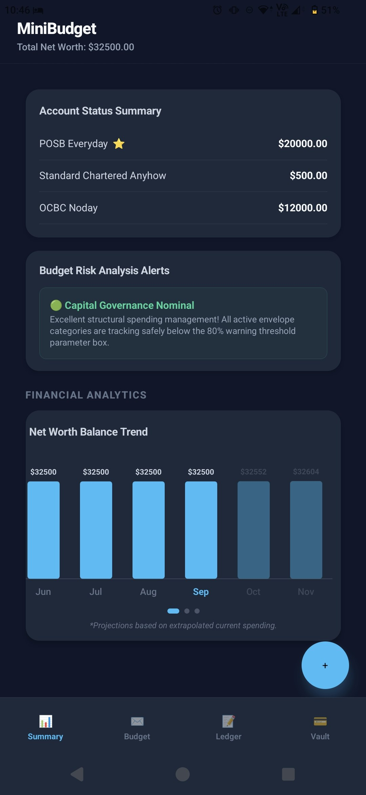
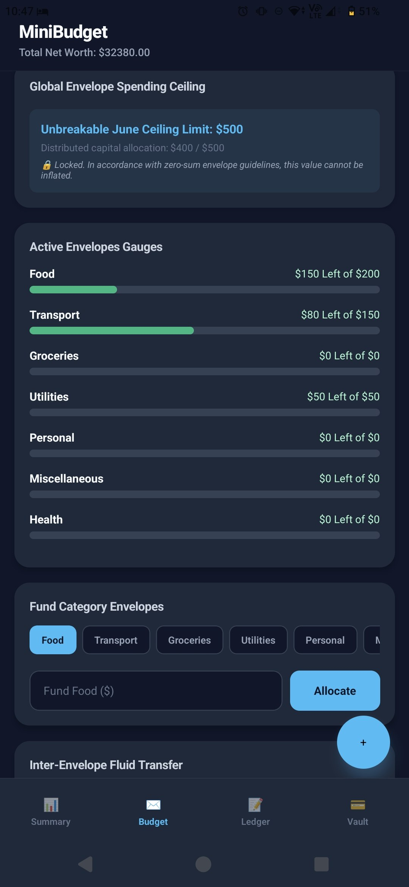
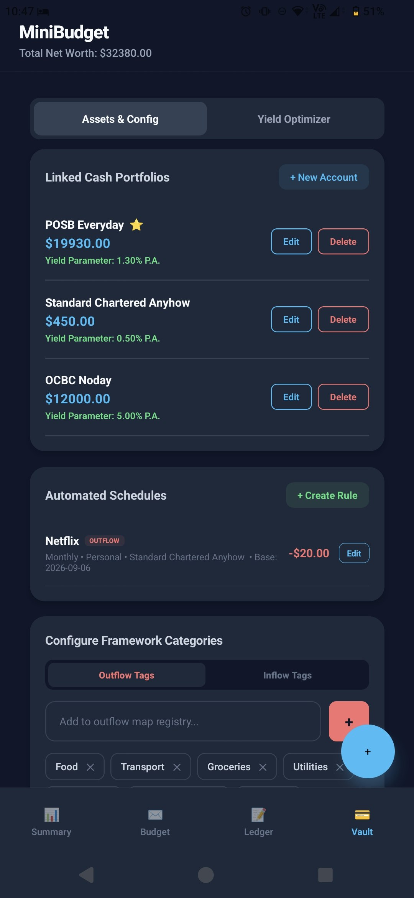
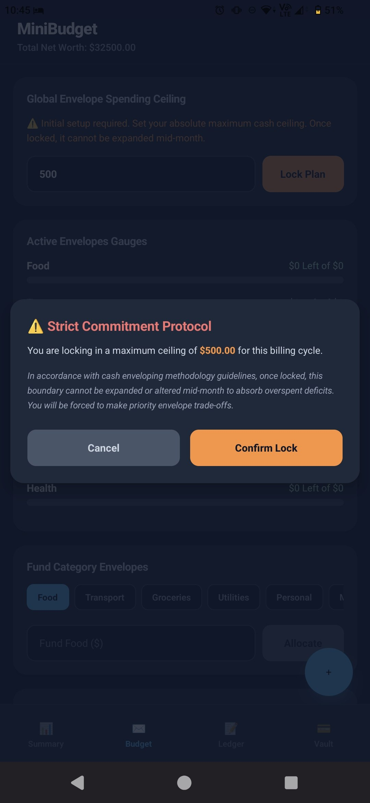
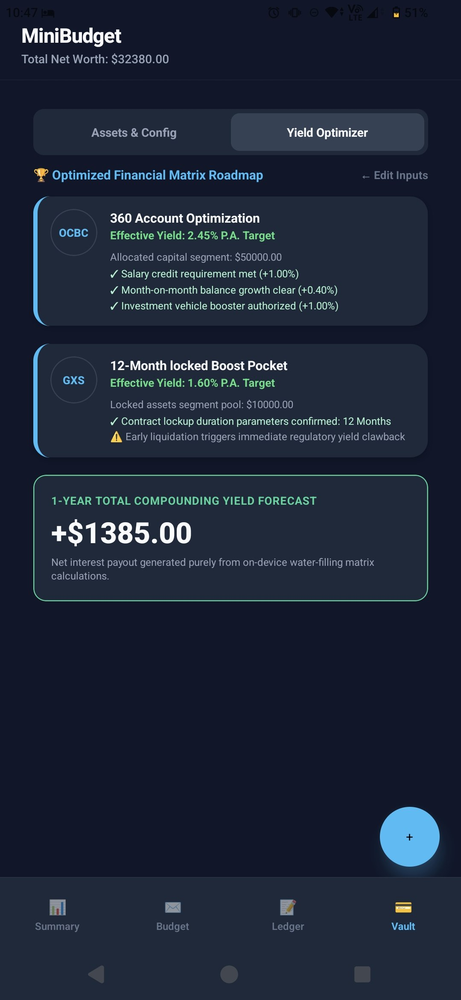
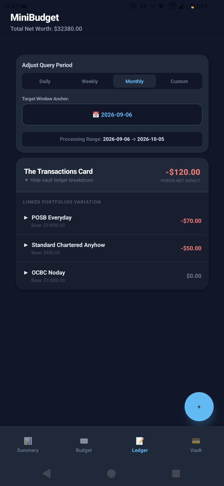
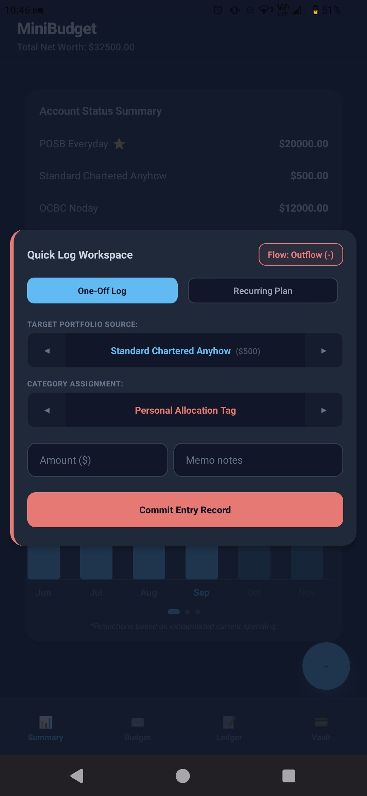

# MiniBudget

A local-first personal finance app that enforces a monthly spending ceiling instead of politely suggesting one. Built with React Native and Expo.

Most budgeting apps let you quietly raise the budget when you overspend. MiniBudget doesn't. Once a month's ceiling is locked it cannot be inflated — overspending has to be absorbed by moving money between envelopes, not by creating more. Every other feature is built around that constraint.

<p align="center">
  
  
  
</p>

---

## Features

### Envelope budgeting with a locked ceiling

Set a monthly spending cap, then distribute it across categories. Allocation is disabled until a ceiling is locked, and locking is deliberately made to feel consequential — a confirmation step spells out that the value cannot be expanded mid-month to absorb a deficit.

Envelope gauges show remaining balance against allocation. Funds can be moved between envelopes with balance validation, but the global ceiling never moves.

<p align="center">
  
</p>

### Yield optimiser

The feature that does the most work. Given available capital, an amount you're willing to lock away, a lock duration, and monthly salary, it distributes capital across Singapore savings products and projects a one-year return.

It models real bonus-tier structures rather than a flat headline rate, and fills greedily — highest effective yield first, up to each product's cap, overflowing the remainder to the next:

| Product | Base | Bonus conditions modelled |
|---|---|---|
| OCBC 360 | 0.05% | salary ≥ $1,800 (+1.00%), month-on-month balance growth (+0.40%), investment activity (+1.00%) |
| SC BonusSaver | 0.05% | salary ≥ $3,000 (+0.90%) |
| GXS Boost Pocket | 0.88% | lock duration — 3mo (+0.34%), 4–11mo (+0.52%), 12mo+ (+0.72%) |

Results show which specific bonus conditions were met per product, and flag early-liquidation clawback on locked capital.

<p align="center">
  
</p>

### Net worth projection and risk alerts

The summary screen tracks a rolling balance trend with historical months solid and projected months dimmed, extrapolated from current spending. A risk panel checks every active envelope against an 80% consumption threshold and surfaces a status banner before a category runs dry rather than after.

### Flexible ledger querying

Transactions can be queried over daily, weekly, monthly, or custom windows anchored to a chosen date. The period card reports net impact for the window and breaks it down per linked account, each showing its base balance and the variation over that period.

<p align="center">
  
</p>

### Recurring automation and account config

Each account carries its own interest rate, used to compound balances on app load. Recurring inflows and outflows are defined as rules with frequency, category, linked account, and direction. Spending categories are user-configurable as separate inflow and outflow tag sets rather than hardcoded.

### Quick logging

A floating action button opens a compact entry sheet from any screen — flow direction, account, category, amount, memo — with a toggle to promote the entry into a recurring rule instead of a one-off. A deep-link handler exposes the same flow from outside the app.

<p align="center">
  
</p>

### Reconciliation

When a real bank balance drifts from the tracked balance, a reconciliation flow adjusts it and records the correction rather than silently overwriting history.

---

## Architecture

The app runs entirely on-device. No backend, no account, no network call — all financial data stays in `AsyncStorage` on the phone.

```
App.js                      Top-level state + manual tab navigation
├── src/screens/
│   ├── SummaryScreen        Balances, risk alerts, net worth trend, category donut
│   ├── BudgetScreen         Ceiling locking, envelope allocation, transfers, audit
│   ├── TransactionsScreen   Ledger with period querying
│   └── Vault/
│       ├── useVaultState.js         Accounts, automations, optimiser inputs
│       └── utils/optimizerEngine.js Greedy cap-fill yield allocation
├── src/components/
│   ├── BudgetGraph.js       SVG trend chart (spending + net worth modes)
│   ├── QuickLogModal.js
│   └── ReconciliationModal.js
└── src/storage/
    └── storageEngine.js     AsyncStorage read/write
```

**Three decisions worth calling out:**

*No navigation library.* Navigation is four buttons switching a `currentView` value. For a fixed four-tab app this avoids a dependency and a re-render layer; the cost is no navigation stack or back-gesture handling, which this app doesn't need.

*Charts hand-drawn in `react-native-svg`.* The donut chart is stroked arcs computed directly rather than a charting library — smaller bundle, full control over the dark palette.

*Interest applied on load, not on a schedule.* Compounding and recurring entries are computed by diffing against the last-opened timestamp when the app starts. No background task, no notification permission, and the numbers are correct whenever you actually look at them.

**Stack:** React Native 0.81 · React 19 · Expo SDK 54 · react-native-paper · react-native-svg · AsyncStorage

---

## Running it

```bash
npm install
npx expo start
```

Scan the QR code with Expo Go, or press `a` / `i` for an Android or iOS emulator.

---

## Limitations

- Savings rates in the optimiser are **hardcoded as of [MONTH YEAR — fill in]**. Bank bonus structures change frequently; nothing is fetched live and the projections will drift.
- The optimiser is a projection tool, not financial advice. It ignores fees, minimum-balance clawbacks, and the practical friction of actually moving money between banks.
- Data is device-local with no export or backup — clearing app data loses everything.
- Single currency (SGD), single user, no multi-device sync.

## Roadmap

- [ ] CSV export / import for backup
- [ ] Configurable rate table so the optimiser survives rate changes
- [ ] Per-category rollover of unspent envelope balances
- [ ] Widen the historical compliance audit beyond four months
